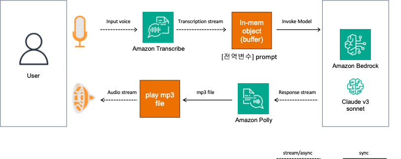

# Voice Chatbot test with Transcribe, Polly and Bedrock (Claude v3 Sonnet)

#### 테스트 환경
- Macbook M1 Pro (Macos Sonoma)


### Architecture 


### 실행 방법

#### 1. 패키지 설치
- Loca(Macbook)에 aws cli 설정은 미리되어 있어야 합니다. (aws configure)
```
python3 -m pip install -r ./requirements.txt
```
 
- macos의 경우 brew를 통한 추가 패키지 설치가 필요할 수 있습니다.
```
brew install portaudio
```

#### 2. 앱 실행
- 사전에 us-east-1에 Bedrock 모델 access 설정은 되어 있어야 합니다.
```
python3 app.py
```


#### 앱이 실행되면, 로컬 환경(랩탑)의 mic 로 음성(한국어)을 말합니다.
> Amazon Transcribe로 한국어 음성을 입력 받습니다. <br>
> Bedrock으로 출력된 응답은 Amazon Polly로 한국어 음성으로 출력 됩니다. 


<br>


### Reference
[aws-samples/amazon-bedrock-voice-conversation](https://github.com/aws-samples/amazon-bedrock-voice-conversation)