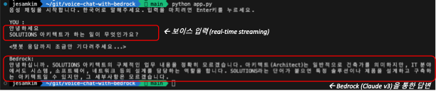

# Voice Chat test with Amazon Transcribe and Amazon Bedrock (Claude v3 Sonnet)

### 실행 방법

#### 1. 패키지 설치
- Local에 aws 자격 증명 설정은 되어 있어야 합니다. (aws configure)
```
python -m pip install -r ./requirements.txt
```

#### 2. 앱 실행
- 사전에 us-east-1에 Bedrock 모델 access 설정은 되어 있어야 합니다.
```
python app.py
```

#### 앱이 실행되면, 로컬 환경의 마이크로 음성(한국어)를 인식합니다.
