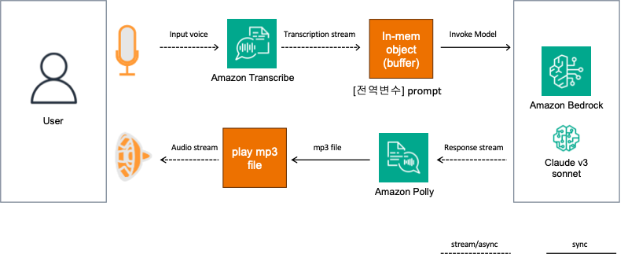
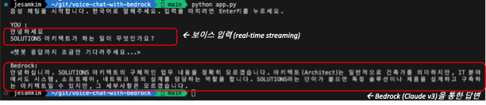

# Voice Chatbot with AWS AI Services

음성으로 대화하는 AI 챗봇입니다. AWS의 Transcribe(음성-텍스트), Bedrock(Claude 3 기반 AI), Polly(텍스트-음성) 서비스를 활용하여 자연스러운 대화형 인터페이스를 제공합니다.

## 주요 기능
- 실시간 한국어 음성 인식 (Amazon Transcribe)
- Claude 3 Haiku 모델 기반의 자연어 처리 (Amazon Bedrock)
- 자연스러운 한국어 음성 합성 (Amazon Polly)
- 양방향 음성 대화 지원

## 아키텍처


## 사전 요구사항

### AWS 설정
1. [AWS CLI 설치](https://docs.aws.amazon.com/cli/latest/userguide/getting-started-install.html)
2. AWS CLI 구성 (`aws configure`)
3. us-west-2 리전에서 Bedrock 모델(Claude 3 Haiku) 접근 권한 설정

### 로컬 환경 설정
- Python 3.x
- macOS의 경우 추가 패키지 필요:
  ```bash
  brew install portaudio
  ```

## 설치 방법

1. 패키지 설치
```bash
python3 -m pip install -r ./requirements.txt
```

## 실행 방법

1. 애플리케이션 실행
```bash
python3 app.py
```

2. 실행 화면


## 사용 방법
1. 애플리케이션이 실행되면 로컬 기기(Macbook)의 마이크를 통해 한국어로 말하세요.
2. Amazon Transcribe가 음성을 텍스트로 변환합니다.
3. Amazon Bedrock(Claude 3)이 응답을 생성합니다.
4. Amazon Polly가 응답을 한국어 음성으로 재생합니다.

## 문제 해결
- 마이크 인식이 안 되는 경우: 시스템 설정에서 마이크 권한을 확인하세요.
- 음성이 재생되지 않는 경우: 시스템 볼륨과 스피커 설정을 확인하세요.
- AWS 서비스 오류: AWS CLI 구성과 권한 설정을 확인하세요.

## 테스트 환경
- MacBook M1 Pro (macOS Sonoma)

## 라이선스
이 프로젝트는 LICENSE 파일에 명시된 라이선스 조건에 따라 배포됩니다.

## 참고 자료
- [aws-samples/amazon-bedrock-voice-conversation](https://github.com/aws-samples/amazon-bedrock-voice-conversation)
